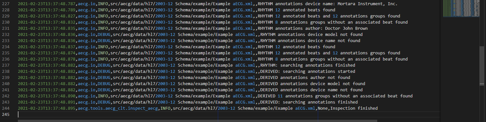

# Tutorial

This tutorial assumes you already installed the software and that have the adequate python or conda environment active. See the [README](README.md) file for instructions on how to install the software.

The sections below provide some examples of use of the `aecg` command line interface. You can check available options by typing `aecg --help` in the command prompt.


You can also get help on each positional argument (i.e., commands) by typing `aecg command --help`. 

By default, the logging system loads its configuration from the *aecg_logging.conf* configuration file provided with the package. The default configuration writes the log data to *aecg.log* in the current directory. In addition to a detailed log file, errors are printed to the console. The log file is a comma separated value file containing the following 6 columns: date and time (in ISO-8601) of the event, module recording the event, level or severity of the event, path to the aECG XML file, path to the Zip file containing the XML (None or empty string if none), message associated with the event.

## Inspection of an aECG file (log file)

You can type the command below from the source code directory to generate an example output from the HL7 example. This will generate log entries as the command line interface parsers the aECG file contents. ERRORS will be printed in the console and the detailed steps will be included in the *aecg.log* file (see screenshots below). Note that the first line of the output indicates the *log* file where command line interface is writing the full detailed log.

```
aecg inspect "src/aecg/data/hl7/2003-12 Schema/example/Example aECG.xml"
```


The warnings in lines 35 and 41 the example log below are because of the optional extension attribute is missing for RHYTHM and DERIVED ID nodes.


...


The screenshot below shows the console output when inspecting one of the minimal examples that does not include unique identifier, waveforms IDs or annotations. You can type `aecg inspect "src/aecg/data/examples/minimum_aecg_nouuid.xml"` from the source code directory to reproduce the output.


By default, the command line interface uses the HL7 aECG schema to validate the XML file first. The validation line (see line 5 in the first log screenshot above) together with the rest of  messages recorded in the log file, particularly warnings and errors, can be helpful to identify aECG files not properly formated or with missing information.

To see available options type `aecg inspect --help`.


## Printing an aECG XML to file

To generate png images of the annotated rhythm and derived beat waveforms in the HL7 example, you can type the command below. This will generate an *aecg_rhytm.png* and an *aecg_derived.png* files in the current directory (see respective screenshots below).

```
aecg print "src/aecg/data/hl7/2003-12 Schema/example/Example aECG.xml"
```


To see all available options type `aecg print --help`.


## Creating an index of aECG files

You can use `aecg index` for indexing the aECG files in a given directory you. To see available options type `aecg index --help`. Note that some of the arguments listed as optional by *--help* are required.


To illustrate the indexing of ECGs in the proposed eCTD structure we can use the command from below. This command will go over all the aECG (xml) files in the *aecg* directory and its subdirectories and will save the study information provided in the command line options together with an index of aECG waveforms found, interval measures, and summary statistics in corresponding sheets within the *FDA000003_test-cli_index.xlsx* (see screenshots below). In addition and unless a different logging configuration is specified, detailed processing information resulting from indexing the aECG files will be written to *aecg.log* in the current directory.

```
aecg index --apptype FDA --appnum 000003 --studyid Test --numsubj 2 --necgsubj 3 --totalecgs 6 --annmethod RHYTHM --annlead II --nbeatsann 3 --sponsor FDA --dir src/aecg/data/ectd_example/FDA000003/0000/m5/datasets/Test/misc/aecg --description "Index of example ECGs generated with aecg command line interface" --oxlsx src/aecg/data/ectd_example/FDA000003/0000/m5/datasets/Test/misc/aecg/FDA000003_test-cli_index.xlsx
```


